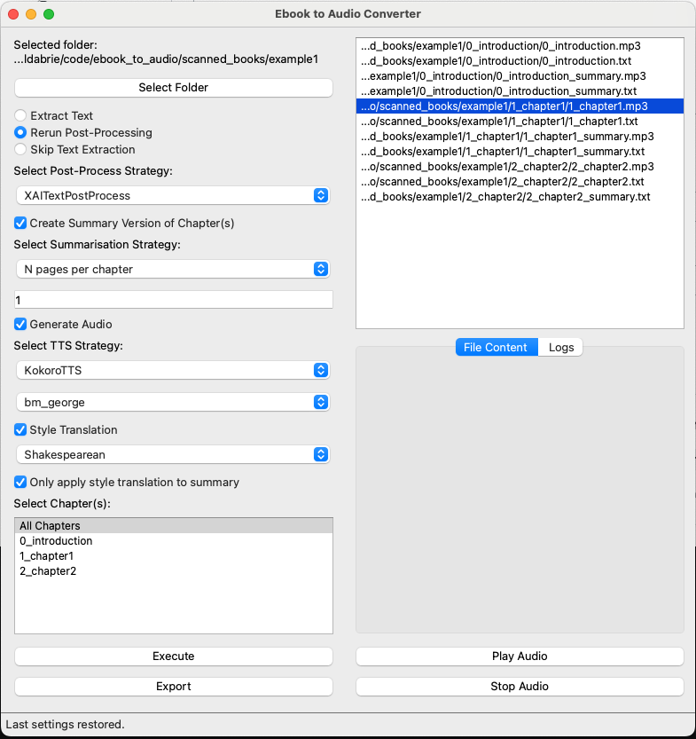

# Ebook to Audio Converter

> **Looking to install? See [INSTALLATION.md](./INSTALLATION.md) for step-by-step setup instructions.**

## Aim of the Project

The Ebook to Audio Converter is a Python application designed to transform scanned book pages into audible content. By leveraging Optical Character Recognition (OCR) to extract text from images and Text-to-Speech (TTS) technologies to convert that text into audio, this project aims to enhance accessibility to literature. It is particularly beneficial for individuals who prefer audio formats, such as those with visual impairments or those who enjoy audiobooks during commutes or multitasking.

## Example Workflow

Below is a step-by-step example of how to use the Ebook to Audio Converter, illustrated with screenshots and sample input images.

### 1. Input: Scanned Book Pages

Suppose you have a set of scanned book pages (JPEG files) like these:

  

These images are placed in chapter folders inside a main book directory.

---

### 2. Select the Folder

Open the application and click **Select Folder** to choose the directory containing your scanned book pages.

---

### 3. Configure Tasks and Strategies

Choose what you want to do: extract text, generate audio, create summaries, and select your preferred OCR, TTS, and post-processing strategies. You can also enable style translation for summaries.

---

### 4. Select Which Chapters to Process

Pick "All Chapters" or select specific chapters to process.

---

### 5. Execute

Click **Execute** to start processing. The log pane will show progress and any messages.

---

### 6. View Resulting Text

Once processing is complete, select a `.txt` file in the file browser to view and edit the extracted or post-processed text.

---

### 7. View Resulting Summary with Style Translation

If you enabled summary generation and style translation, you can view the styled summary text.

---

### 8. Play Audio

Select an `.mp3` file to play the generated audio directly in the application.

---

This workflow demonstrates how the Ebook to Audio Converter takes you from raw scanned images to high-quality, styled, and narrated text and audio—all in a few clicks.

## Installation

For detailed installation instructions, please see [INSTALLATION.md](./INSTALLATION.md).

## Main Components

The application is built with a modular architecture, comprising the following key components:

- **OCR Strategies**:

  - `EasyOCROCR`: Uses the EasyOCR library for efficient text extraction from images.
  - `TesseractOCR`: Employs the Tesseract OCR engine, enhanced with image preprocessing for improved accuracy.

- **TTS Strategies**:

  - `GTTSStrategy`: Utilizes Google Text-to-Speech for reliable and natural-sounding audio output.
  - `ParlerTTSStrategy`: Integrates the Parler TTS model, offering customizable voice synthesis.
  - `KokoroTTSStrategy`: Implements the Kokoro TTS model with multiple voice options for varied narration styles.

- **Post-Processing**:

  - `XAITextPostProcessStrategy`: Refines OCR-extracted text by correcting errors (e.g., joined words, spelling mistakes) and formatting it for better TTS compatibility, using an AI-driven API.

- **Repository**:

  - `FileSystemRepo`: Manages the storage of extracted text and generated audio files in a structured filesystem.

- **User Interface**:

  - A PySide6-based graphical user interface (GUI) that provides an intuitive way to configure and control the conversion process.

## Summary of Features

- **Remembers All Settings**: The application now remembers all user settings (not just the last folder) between runs, including OCR/TTS strategies, summary and style options, and more.
- **Editable File Browser**: The UI file browser pane allows you to view and edit text files directly. A Save button lets you write changes back to disk.
- **Folder Selection**: Select a directory containing scanned book pages (JPEG/JPG files).
- **Strategy Customization**: Choose from available OCR and TTS strategies, with voice selection for Kokoro TTS.
- **Chapter Processing**: Process all chapters or a specific chapter within the selected folder.
- **Flexible Actions**: Extract text, generate audio, rerun post-processing, or skip text extraction as needed.
- **Export Capabilities**: Save processed text and audio files to a designated repository.
- **Interactive UI**: View, edit, and save extracted text, play generated audio, and manage files directly from the interface.
- **Abbreviated Chapters**: Generate concise, narrated summaries of chapters or the entire book using Grok AI, with configurable summary length and export/audio support.
- **Style Translation**: Optionally apply style translation to summaries or all text, with a variety of preset and custom styles.
- **Robust Audio Conversion**: Uses `ffmpeg` via subprocess for MP3 conversion, avoiding segfaults and memory issues.
- **Graceful Cancellation**: Processing can be cancelled at any time, with all child processes and resources cleaned up.
- **No Multiprocessing for OCR/TTS**: All OCR and TTS operations are now sequential for maximum stability.

## How Everything Comes Together in the UI

The PySide6-based UI ties all components into a cohesive and user-friendly experience:

1. **Folder Selection**:

   - Users begin by clicking "Select Folder" to choose a directory with scanned book pages. The folder path is displayed with truncation for readability.

2. **Configuration Options**:

   - **Text Extraction Options**: Radio buttons allow users to choose "Extract Text," "Rerun Post-Processing," or "Skip Text Extraction."
   - **Audio Generation**: A checkbox enables audio generation.
   - **Strategy Selection**: Dropdown menus offer choices for OCR (EasyOCR, Tesseract), TTS (Kokoro, GTTS, Parler), and post-processing (XAI) strategies. For Kokoro TTS, a dynamic voice selection dropdown appears.
   - **Summary and Style**: Options for summary generation, summary strategy, number of pages, style translation, and whether to apply style only to summaries.
   - **Chapter Selection**: A list allows selection of "All Chapters" or specific chapter folders detected in the directory.

3. **Execution**:

   - The "Execute" button triggers the selected actions (text extraction, post-processing, audio generation) based on the chosen chapter and strategies. Processing can be cancelled at any time.

4. **File Interaction**:

   - A list widget displays processed files (text and audio). Clicking a text file shows its content in an editable text area, with a Save button to write changes back to disk.
   - Selecting an audio file enables "Play" and "Stop" buttons for playback using QMediaPlayer.

5. **Export**:

   - The "Export" button saves processed chapters to a `FileSystemRepo`, organizing text and audio in a structured directory.

The UI abstracts the complexity of OCR, TTS, and file management, providing real-time feedback and control over the conversion process.

## Rationale for the Implementation

This implementation stands out for several reasons:

- **Modular Design**: The use of strategy patterns for OCR, TTS, and post-processing ensures components are interchangeable and extensible. New strategies can be added without altering the core application.
- **User-Centric UI**: The PySide6 GUI simplifies interaction, making the tool accessible to non-technical users while offering flexibility for advanced customization.
- **Quality Focus**: Post-processing with XAI corrects OCR errors and optimizes text for TTS, ensuring high-quality audio output.

This balance of flexibility, usability, and performance makes the application both practical and scalable.

## Future Work

- **Expanded TTS Options**: Incorporate additional voices and languages for greater personalization and accessibility.
- **Cloud Storage Integration**: Enable saving and retrieving files from cloud services like Google Drive or Dropbox for seamless access across devices.
- **Batch Editing**: Allow batch editing and saving of multiple text files.
- **Improved Error Reporting**: More detailed error messages and logs for troubleshooting.